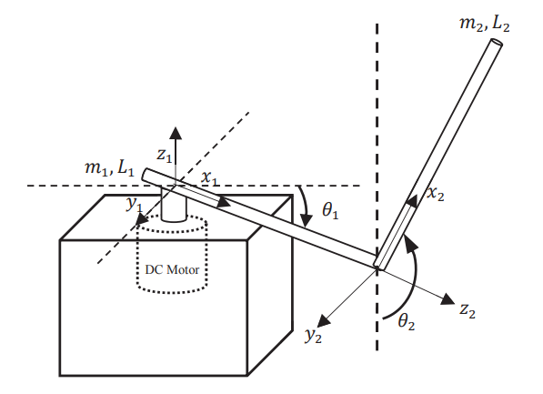

# underactuated-furuta-pendulum
We go back in time to explore Mark Spong's first techniques to control underactuated systems, and we apply one modified technique he used in an acrobot to a furuta pendulum. Problem with classic Partial Feedback Linearization always was the Zero Dynamics (commonly unstable). We use the modified techniques to stabilize it in the upright position from any initial condition using Lyapunov techniques.

Full research at: https://ieeexplore.ieee.org/document/8256125
